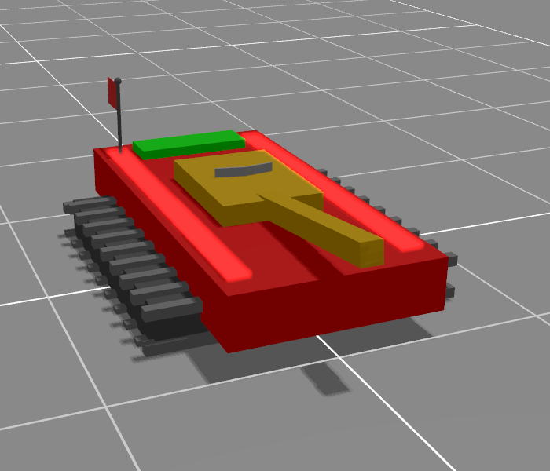
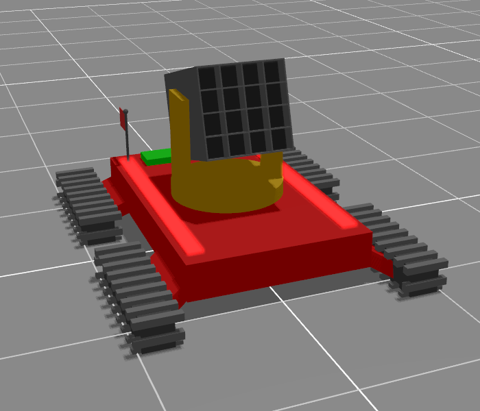

# Battleground Construct


In this simulation game, it's up to you to write a controller for your team's units; you write this
controller / ai in [Rust](https://www.rust-lang.org/) and compile it into a `.wasm` file which you
can load into the battleground viewer or headless simulator. The file is self-contained, so you can
exchange the compiled `.wasm` file with your friends and see who writes the best controller!

## Getting Started

It should be easy to get started, but hard to master. The quick start steps are the following:

1. Ensure you can compile `wasm32-unknown-unknown` with Rust, install this target with:
```
rustup target install wasm32-unknown-unknown
```
2. Clone this repo with;
```
git clone https://github.com/iwanders/battleground_construct
cd battleground_construct
```
3. Build the example controller in [unit_control_example](unit_control_example), this compiles it
  into a stand-alone `.wasm` file:
```
cd unit_control_example
cargo build --release --target wasm32-unknown-unknown
```

4. In a new terminal go to the [battleground_viewer](battleground_viewer) directory. From there run
  the viewer, specifying the correct feature to be able to load the `.wasm` file that was just
  created in the `target` directory. The scenario loaded is one of the built in tutorial scenarios:
```
cd ../battleground_viewer
cargo run --release --features unit_control_wasm -- scenario tutorial_01_driving_forward --team player:../target/wasm32-unknown-unknown/release/unit_control_example.wasm
```
5. The battleground viewer should start and you should see a red tank unit rotate in place.
6. In the [example](unit_control_example)'s code, search for `MODULE_TANK_DIFF_DRIVE` and make your
  tank drive forwards. Recompile the controller by running
  `cargo build --release --target wasm32-unknown-unknown` from its directory.
  Restart the viewer with the same command as before, it does not have to recompile so this should
  be quick this time.
7. The tank should drive into the capture area for the point and fireworks should indicate your
   victory.


One can also make changes while keeping the viewer running; each time you recompile the `.wasm`
file, the viewer automatically reloads it without requiring a restart. You can restart the
scenario by pressing the `r` key in the viewer, this can be helpful during development.

Further tutorial files are available, in the `battleground_viewer` directory, run 
`cargo r --release --features unit_control_wasm -- scenario list` for a list of tutorials.


To get a feel what a match looks like with very naive unit controllers, run
`cargo run --release --features unit_control_wasm -- scenario match_demo`.

## Running and viewing

The simulation can be ran in headless mode by running the binary from the
[battleground_construct](./battleground_construct) crate. This binary can also record the entire
match to a recording file. The built in scenarios can be used, as well as a path to a file.
For example, from the [battleground_construct](./battleground_construct) directory, the following
command:

```
cargo run --release --features unit_control_wasm -- scenario src/config/scenario/match_2v2.yaml --team red:red_team.wasm --team blue:blue_team.wasm -w /tmp/recording.bin
```

Would run the `match_2v2.yaml` scenario headless, replace the red team's controller with the
specified `red_team.wasm`, blue with `blue_team.wasm`and record the match to `/tmp/recording.bin`.
For a full list of available options for either the battleground_viewer or battleground_construct:
```
cargo run --release --features unit_control_wasm -- --help
```

Such a recording can be played back in the viewer, for example with:
```
cargo run --release -- play /tmp/recording.bin
```

The viewer can be ran natively, but can also be compiled for use in a web-browser, please see its
[readme](./battleground_viewer) file for more information. The main functionality of this is to view
recordings that are accessible from the same server as the one hosting the viewer's html / js. This
means that if you run a tournament you can host all the recordings and send contestants links to the
matches for viewing.

The supported commandline arguments for the viewer and headless runner are identical. Be sure to
pass the `--features unit_control_wasm` flag to be able to load `.wasm` files, this is not necessary
for the viewer to be able to play recordings made with a `wasm` based unit controller.

## Unit Control

Controlling your unit is hard - period - this is intentional. The goal of this simulation game was
to provide a gamified way for roboticists to learn Rust, as well as to provide the main
author of this project with a reason to learn about [entity component systems](https://en.wikipedia.org/wiki/Entity_component_system)
, if you are looking for something relaxing you can play on the couch, move along. If you are up for
a challenge, read on!

Your unit's controller should implement [`UnitControl`](battleground_unit_control/src/unit_control.rs), 
it's update method gets called periodically.

The controller interacts with your unit through the [`Interface`](battleground_unit_control/src/interface.rs).
The interface provides access to the `modules`, each module can hold multiple `register`s, each
`register` is either an `i32`, `f32` or `Bytes` register. You can read and write registers, some
registers are read only.

The modules are things like:
- [gps](battleground_unit_control/src/modules/gps.rs): provides your unit's position in the world.
- [revolute](battleground_unit_control/src/modules/revolute.rs): joint controller to measure and
  control rotational joints, like the tank turret's yaw or the barrel pitch.
- [cannon](battleground_unit_control/src/modules/cannon.rs): to control firing of the cannon.
- [draw](battleground_unit_control/src/modules/draw.rs): draw lines in the world, these
  lines are shown whenever the unit is selected in the viewer. This is _very_ helpful for debugging.
- [radar](battleground_unit_control/src/modules/radar.rs): to detect other units.
- ... and more , run `cargo doc` and look for the [battleground_unit_control](battleground_unit_control) crate.

It's up to you to write abstractions for these module registers if you feel that is necessary to
control your unit well. Relevant dimensions for units can be accessed through the
[battleground_unit_control's units](battleground_unit_control/src/units) module, if you need any
other values; look around in the [source](battleground_construct) code.

### Units

Currently, there are two unit types.

### Tank

This is the standard / default unit, it has a good radar a single cannon to shoot point projectiles
without splash damage; only direct hits against another unit will do damage. You'll want to use
these units on the front lines to act as the eyes for your artillery and take control of the capture
points.

The vehicle has a differential drive base. The turret rotation joint is located exactly above the
differential drive base. There is a rigid member between the turret joint and the barrel joint.
The radar is located exactly above the turret joint.


### Artillery


This unit is larger than the tank, drives slower, rotates it's gun slower and has a poor radar, what
it lacks in mobility it makes up in firepower. It's projectiles do splash damage so even non-direct
hits will have significant effects on opposing units. You'll have to communicate with units that
have better radars to get the most out of this unit.

The vehicle has a differential drive base. The turret rotation joint is located exactly above the
differential drive base. Exactly above the turret joint is the barrel joint. The radar joint is
located above the turret joint. There is a rigid member between the radar joint and the radar.


## Game rules

The configuration of the simulation game is specified in a scenario file, several of these, like the
tutorial are compiled into the binary. These scenario specifications can be found in
[this](battleground_construct/src/config/scenario) directory. These files specify what teams exist
and their units and the controllers, controllers can be overwritten from the commandline. These yaml
files are loaded from the `ScenarioConfig` struct in the [specification](./battleground_construct/src/config/specification.rs).

Currently supported game modes for the scenarios are the following:

- Team deathmatch: First team to destroy the set number of units of any opposing team wins.
- King of the Hill: Fight over capture points, first team to reach the limit wins.
- Domination: Like king of the hill, but if you destroy a set number of opposing units and hold all
  capture points victory is yours. So this can be used as a king of the hill without having to wait
  for the points to count up after defeating all opposing units.

All game modes can optionally support a time limit.

A few more things of note around the rules:
- If your controller panics or returns an `Err`, your unit will self destruct and you get a backtrace
  in the console.
- Wasm unit controllers can be configured to have limited computational resources, exceeding this
  would return an `Err` and lead to the destruction of the unit.
- You can shoot (and hit) your own units, you have a radio
[receiver](battleground_unit_control/src/modules/radio_receiver.rs)
and
[transmitter](battleground_unit_control/src/modules/radio_transmitter.rs) to talk between your units
to prevent that.
- Electronic warfare is authorized (and unless prevented in the configuration) the
  units can transmit and receive on the same radio channels as other teams. If you can make your
  oponent's unit controllers panic or error out and they self destruct, that is a valid strategy.
- The [radar](battleground_unit_control/src/modules/radar.rs) sees both friendly and unfriendly units.
- The z coordinate is positive facing upwards (further into the sky).
- If your unit is moving while shooting, the velocity of the unit carries over into the projectile.
- There should be no randomness / non-determinism in the simulation, the viewer does use it in
  visualisations but they do not affect the simulation.
- The source code defines the rules and trumps whatever documentation / description exists.

## Further information

- For your unit controller, run `cargo doc` and look for the [battleground_unit_control](./battleground_unit_control) crate.
- The [unit_control_example](./unit_control_example) crate holds an example controller that compiles to a `.wasm` module.
- The [battleground_viewer](./battleground_viewer) crate allows you to visualise the construct (native and in the browser), see its readme for instructions.
- The [battleground_construct](./battleground_construct) crate contains all simulation / game logic.
- The [engine](./engine) holds the [entity component systems](https://en.wikipedia.org/wiki/Entity_component_system)
  on which the game runs.
- The [unit_control_builtin](./unit_control_builtin) crate holds the very limited built in controllers.
- The [unit_control_wasm](./unit_control_wasm) crate implements a unit controller that loads a `.wasm` module, it is an optional dependency of battleground_construct.

## License
License is [`BSD-3-Clause`](./LICENSE).
